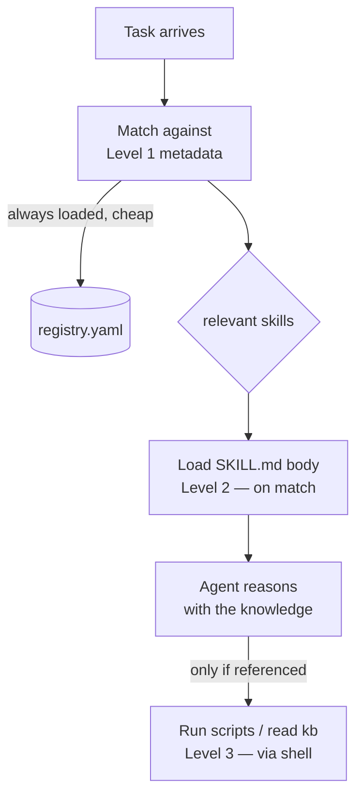

# SkillPack

> **Agent capability that loads only when the task needs it.**

[](https://github.com/qa-veritas)
[](https://github.com/qa-veritas)
[](https://github.com/qa-veritas/skillpack/actions/workflows/ci.yml)

*A component of [**QA Veritas**](https://github.com/qa-veritas) — an exploration of how AI agents reason about, verify, and operate complex systems.*

---

## Problem

The instinct when giving an agent capability is to stuff every instruction it *might* need into one system prompt. This makes the agent worse at all of them: context is a budget, and a prompt bloated with thirty procedures spends it on the twenty-nine that aren't relevant to the task in front of it. Capability that doesn't scale with the number of skills isn't capability — it's a ceiling.

## Core Idea

Load capability progressively, in three levels, paying only for what a task actually needs:

```
Level 1  registry metadata (name + description)   always loaded     ~100 tokens/skill
Level 2  the SKILL.md body                          on match          < 5k tokens
Level 3  scripts/ and kb/ resources                 on reference      unbounded — run via shell
```

A skill is **self-contained, composable, prompt-driven, and filesystem-based.** It carries *knowledge* — what to look at, what each signal means — not a fixed command list. The agent reasons; the skill informs. Matching is deliberately transparent (token overlap over name + description + tags); the point isn't a clever ranker, it's that the agent only pays for the skills a task invokes.

## Architecture Diagram



## Concepts

- **Progressive disclosure** — three loading levels keep the context budget spent on the task, not the catalog.
- **Knowledge, not command lists** — a skill says *what matters and why*; the agent decides *how*. (A skill that hands a fixed command list is a script in costume.)
- **Composability** — skills reference each other (cluster-health pulls disk-pressure); composition is the test of whether a skill is real.
- **Smoke-checkable** — a skill can ship a cheap `scripts/smoke.sh` that proves its preconditions before the agent relies on it.

## Examples

Matching a task to the skills that should load — transparent and cheap:

```
$ python -m skillpack match "the data mount is filling up, will it run out tonight"
1. check_disk_pressure    score 0.42   Decide whether storage is under pressure...
2. analyze_cluster_health score 0.11   Turn a cluster health snapshot into a verdict...
```

Eight skills ship as worked examples, spanning the platform's reasoning surface: disk pressure, log summarization, cluster health, failure explanation, resource-leak detection, triage planning, verification strategy, and root-cause identification.

## Quick Start

```bash
pip install -e .          # or: python -m skillpack --help

python -m skillpack list                                    # Level 1: metadata only
python -m skillpack match "mount filling up, will it run out tonight"   # task → skills
python -m skillpack show check_disk_pressure                # Level 2: full instructions
python -m skillpack validate                                # every skill well-formed?
```

Python 3.10+. One dependency (`pyyaml`).

## Why It Matters

For **engineers**: a growing library of capability stays navigable and cheap. Adding the hundredth skill doesn't degrade the first ninety-nine, because nothing loads until a task matches it.

For **AI agents**: this is how agentic capability *scales*. It's the mechanism behind the platform's other components — the triage, verification, and diagnostic knowledge an agent applies is packaged as skills it loads on demand. It is the connective tissue between [State Triage](https://github.com/qa-veritas/state-triage)'s reasoning and the future agents that will compose it.

## Future Vision

- Pluggable matchers (embedding-based) behind the same interface, swappable without touching callers.
- A `bundle` command to export matched skills as one context payload for a headless run.
- Skill dependency edges (`composes_with`) surfaced in `match` so a matched skill pulls its collaborators.
- Per-skill versioning and a `diff` against the installed set.

---

## Part of QA Veritas

**QA Veritas** explores *AI-Native Verification Engineering* — practical patterns for a future where humans and AI agents operate complex systems together. Every component serves one loop:

**Memory → Reasoning → Verification → Action**

```
QA Veritas
├── Resource Ledger                    Memory       operational truth as a git tree
├── State Triage                       Reasoning    deterministic triage around an agent
├── LogLens                            Reasoning    code-aware evidence from logs
├── Intent Verify                      Verification declarative intent → observable proof
├── Runbook Forge                      Runbooks     procedures derived from verified history
├── SkillPack         ◀ you are here   Skills       progressive-disclosure agent capability
└── Future Agents                      Agents       narrow operators that compose the above
```

| Layer | Component |
|-------|-----------|
| Memory | [Resource Ledger](https://github.com/qa-veritas/resource-ledger) |
| Reasoning | [State Triage](https://github.com/qa-veritas/state-triage) · [LogLens](https://github.com/qa-veritas/loglens) |
| Verification | [Intent Verify](https://github.com/qa-veritas/intent-verify) |
| Runbooks | [Runbook Forge](https://github.com/qa-veritas/runbook-forge) |
| **Skills** | **SkillPack** (this repo) |
| Writing | [Field notes & essays](https://github.com/qa-veritas/writing) |

Start at the [platform overview](https://github.com/qa-veritas). MIT licensed.
